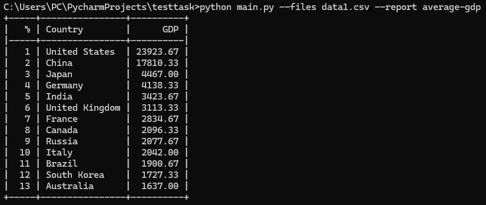
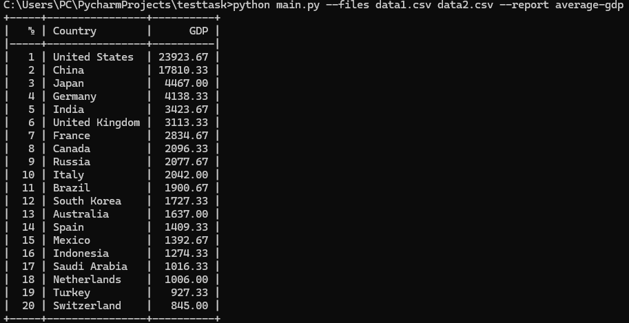

## Установка

```
pip install -r requirements.txt
```

## Запуск

```
python main.py --files file1.csv --report average-gdp
```

## Новые отчеты должны храниться в корневой папке (где лежит main.py)

## Примеры работы

### запуск с 1 файлом:



### запуск с 2 файлами:

